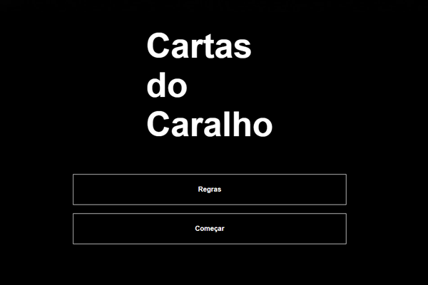

  

<h2 align="center"> <a href="https://rerigan.vercel.app/Extra/Cartas-do-Caralho/index.html" target="_blank">Cartas do Caralho</a></h2>

Esse site é um a adaptação de um jogo de tabuleiro chamado "Cards Against Humanity". Ele foi feito pra jogar presencialmente, ou seja, cada um abre o site no próprio celular e os usam como as cartas seriam usadas no jogo convencional. 

 

## 🚀 Tecnologias

Esse projeto foi desenvolvido com as seguintes tecnologias:

- HTML e CSS - estilização
- JavaScript - randomização e consumo de arquivo .JSON

## ...

Pretendo fazer algumas melhorias no projeto, como recriá-lo utilizando React e também no futuro tentar implementar um modo online.
       

  

